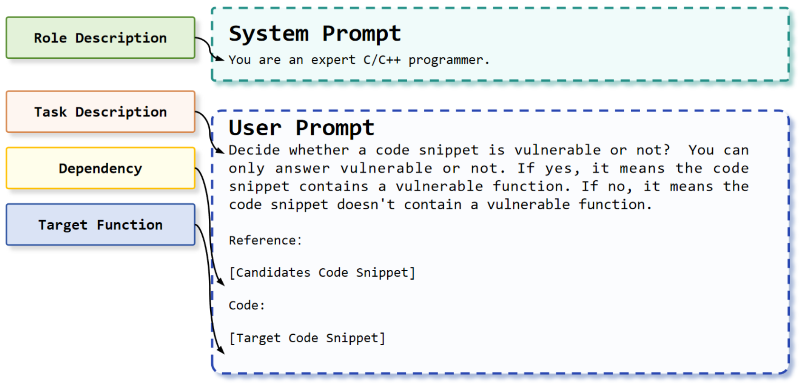

<div align="center">
    <p>
    <h1>
    VulEval
    </h1>
    
    </p>
    <p>
    (Logo generated by DALL·E 3)
    </p>
    <a href="https://github.com/ddlBoJack/MT4SSL"></a>
    <a href="https://github.com/ddlBoJack/MT4SSL"></a>
    <a href="https://github.com/ddlBoJack/MT4SSL"></a>
</div>

<div align="center">
  <a>
    <b><em>More than Single Functions: Towards Holistic 
    Evaluation of <br>Software Vulnerability Detection</em></b>
  </a>
  <br></br>
  
</div>
<hr>


## 📥 Load Data

Dataset is available at:

### Download Data via Google Drive
1. Download the all data from [Google Drive](https://drive.google.com/file/d/1szQ9FnIC_onQRu_TjZ2uofkjv9z_s4pv/view?usp=drive_link), or simply use the following links:
```bash
https://drive.google.com/file/d/1szQ9FnIC_onQRu_TjZ2uofkjv9z_s4pv/view?usp=drive_link
```

## 🚨 Abstract

Deep Learning (DL)-based methods have proven to be effective for software vulnerability detection, with a potential for substantial productivity enhancements for detecting vulnerabilities. Current methods mainly focus on detecting single functions (i.e., intra-procedural vulnerabilities, ignoring the more complex inter-procedural vulnerability detection scenarios in practice.  For examples, developers routinely engage with program analysis to detect vulnerabilities that span multiple functions within repositories. In addition, the widely-used benchmark datasets generally contain only intra-procedural vulnerabilities, leaving the assessment of inter-procedural vulnerability detection capabilities unexplored.

To mitigate the issues, we propose a holistic multi-level evaluation system, named **VulEval**, aiming at evaluating the detection performance of inter- and intra-procedural vulnerabilities simultaneously.Specifically, VulEval consists of three interconnected evaluation tasks: 
**(1) Function-Level Vulnerability Detection**, aiming at detecting intra-procedural vulnerability given a code snippet; **(2) Vulnerability-Related Dependency Prediction**, aiming at selecting the most relevant dependencies for providing developers with explanations about the vulnerabilities; and **(3) Repository-Level Vulnerability Detection**, aiming at detecting inter- and intra-procedural vulnerabilities simultaneously. For exploring the current vulnerability detection methods' performance in the third task, we propose a repository-level vulnerability detection framework by combining with the dependencies identified in the second task. \tool also consists of a large-scale dataset, with a total of 4,196 CVE entries, 232,239 functions, and corresponding 4,699 repository-level source code in C/C++ programming languages.

## Implementation
⚖️ **Function-Level Vulnerability Detection**

The baseline's implementation code is under the  ```VulnerabilityDetection\```  folder.

📅 **Vulnerability-Related Dependency Prediction** 

The baseline's implementation code is under the  ```DependencyPrediction\```  folder.

🔔 **Repository-Level Vulnerability Detection** 

The baseline's implementation code is under the  ```VulnerabilityDetection\```  folder.

## Response
<p>
    Figure S1: The prompt template for VulEval.
    
</p>

Table S1: The number of related CVE entries, dependency and function tokens in each split, respectively.

| Set | CVE Entries| Dependency Tokens | Function Tokens |
| ---- | --- | ---------- | -------- |
| train | 3393 / 2747 | 866.58 / 881.88 | 321.44 / 320.94 |
| valid | 2895 / 335 | 861.26 / 775.25 | 315.9 / 307.3 |
| test | 2895 / 328 | 824.87 / 834.36 | 317.7 / 330.3 |
| total | 3405 / 3405 | 862.05 / 862.05 | 320.51 / 320.51 |


## Baselines
```
VulEval 
├─ VulnerabilityDetection
│    ├─ Supervised
│    │    ├─ Devign
│    │    ├─ Reveal
│    ├─ Finetuning
│    │    ├─ CodeBERT
│    │    ├─ CodeT5
│    │    ├─ UnixCoder
│    │    ├─ LineVul
│    │    ├─ EPVD
│    │    ├─ PILOT
│    │    ├─ PDBERT
│    ├─ Prompt
│    │    ├─ CodeLlama_LLaMA
│    │    ├─ ChatGPT_GPT-3.5-Instruct
├─ DependencyPrediction
│    ├─ Random
│    │    ├─ Random
│    ├─ Lexical
│    │    ├─ ES
│    │    ├─ JS
│    │    ├─ BM25
│    │    ├─ BM25Plus
│    ├─ Semantic
│    │    ├─ CodeBERT
│    │    ├─ UnixCoder
├─ README.md
```


